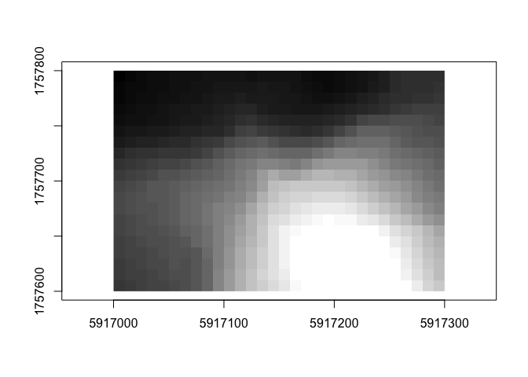

<!-- README.md is generated from README.Rmd. Please edit that file -->

# grd

<!-- badges: start -->

[](https://lifecycle.r-lib.org/articles/stages.html#experimental)
[](https://codecov.io/gh/paleolimbot/grd?branch=master)
[](https://github.com/paleolimbot/grd/actions)
<!-- badges: end -->

The goal of grd is to do provide data structures and a minimal set of
generics to work with grids of points or rectangles (i.e., raster data).
The grd package is built on top of
[wk](https://github.com/paleolimbot/wk) and uses the `rct()` and `xy()`
structures heavily.

## Installation

You can install the development version from
[GitHub](https://github.com/) with:

``` r
# install.packages("remotes")
remotes::install_github("paleolimbot/grd")
```

## Example

Use `grd_rct()` or `grd_xy()` to construct a grid from a matrix and a
`wk::rct()`.

``` r
library(grd)

bbox <- rct(
  5917000,       1757000 + 870,
  5917000 + 610, 1757000,
  crs = "EPSG:2193"
)

grid <- grd_rct(volcano, bbox)
plot(grid)
```


You can use `grd_crop()`, `grd_extend()`, or `grd_subset()` to select
parts of a grid whilst keeping each cell’s relationship to space:

``` r
plot(grd_subset(grid, 1:30, 1:30))
```


``` r
plot(grd_crop(grid, rct(5917000, 1757600, 5917300, 1757800)))
```



Use `grd_cell()` or `grd_cell_range()` to find cell indices based on a
spatial query; use `grd_cell_rct()` or `grd_cell_xy()` to get
information about specific cells:

``` r
(cell_ids <- grd_cell(grid, xy(5917100, 1757700)))
#>    i  j
#> 1 18 11
grd_cell_xy(grid, cell_ids)
#> <wk_xy[1] with CRS=EPSG:2193>
#> [1] (5917105 1757695)
grd_cell_rct(grid, cell_ids)
#> <wk_rct[1] with CRS=EPSG:2193>
#> [1] [5917100 1757690 5917110 1757700]
```
